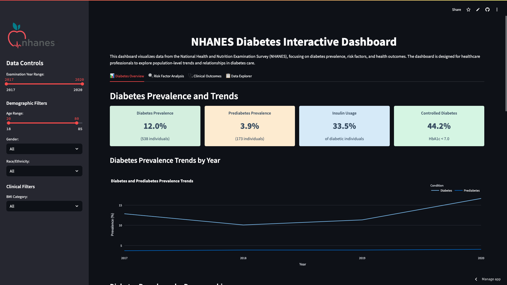

# NHANES Diabetes Dashboard

[](https://yashasvi14-healthcare-data-das-nhanes-diabetes-dashboard-pmzmoi.streamlit.app/)

An interactive data visualization dashboard for exploring diabetes risk factors and health outcomes based on the National Health and Nutrition Examination Survey (NHANES) data.



## 🌟 Live Demo

Explore the live dashboard at [https://yashasvi14-healthcare-data-das-nhanes-diabetes-dashboard-pmzmoi.streamlit.app/](https://yashasvi14-healthcare-data-das-nhanes-diabetes-dashboard-pmzmoi.streamlit.app/)

## 📋 Overview

The NHANES Diabetes Dashboard is a comprehensive tool designed for healthcare professionals, researchers, and policy makers to explore population-level trends and relationships in diabetes prevalence, risk factors, and health outcomes. This interactive visualization platform transforms complex NHANES datasets into actionable insights through a user-friendly interface.

## ✨ Features

- **Interactive Filtering**: Filter data by demographic factors (age, gender, race/ethnicity) and clinical parameters
- **Comprehensive Analysis Tabs**:

  - 📊 **Diabetes Overview**: Prevalence trends, demographic breakdowns, and geographic distribution
  - 🔍 **Risk Factor Analysis**: BMI distribution, risk factor comparisons, correlation analysis, and relationship exploration
  - 🩺 **Clinical Outcomes**: HbA1c distributions, diabetes complications analysis, treatment patterns, and complication risk assessment
  - 📋 **Data Explorer**: Customizable data views, summary statistics, and visualization tool

- **Insightful Visualizations**:
  - Interactive charts and graphs using Plotly
  - Correlation matrices for understanding risk factor relationships
  - Geographic visualizations for spatial patterns
  - Treatment and outcome analysis for clinical insights

## 🧰 Technology Stack

- **Streamlit**: For the interactive web application framework
- **Pandas**: For data manipulation and analysis
- **NumPy**: For numerical computing
- **Plotly**: For interactive visualizations
- **Matplotlib & Seaborn**: For additional visualization capabilities
- **SciPy & StatsModels**: For statistical analysis

## 🚀 Getting Started

### Installation

1. Clone this repository:

```bash
git clone https://github.com/yashasvi14/Healthcare_data_dashboard.git
cd Healthcare_data_dashboard
```

2. Install required packages:

```bash
pip install -r requirements.txt
```

3. Run the Streamlit app:

```bash
streamlit run nhanes_diabetes_dashboard.py
```

## 📊 Data Source

This dashboard uses simulated data that resembles the structure and patterns of the NHANES dataset. In a production environment, this would be replaced with actual NHANES data from the [CDC NHANES website](https://www.cdc.gov/nchs/nhanes/?CDC_AAref_Val=https://www.cdc.gov/nchs/nhanes/index.htm).

The simulation creates realistic relationships between:

- Demographic factors (age, gender, race/ethnicity, education, income)
- Clinical measurements (BMI, blood pressure, HbA1c, cholesterol)
- Risk factors (family history, physical activity, smoking status)
- Health outcomes (diabetes status, complications)

## Acknowledgments

- CDC NHANES for providing the inspiration and data structure
- Streamlit for their excellent framework for data applications
- The open-source community for all the amazing libraries that made this possible
